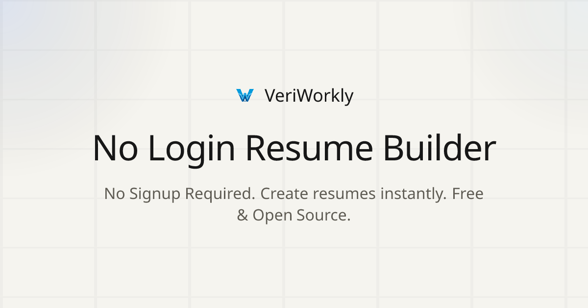
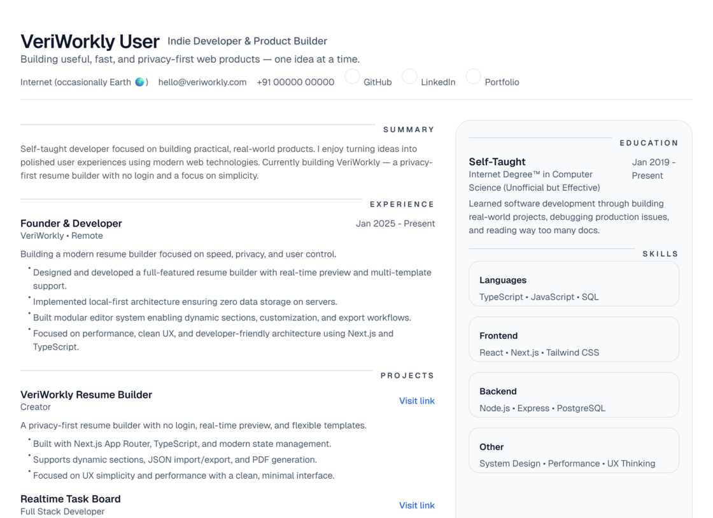
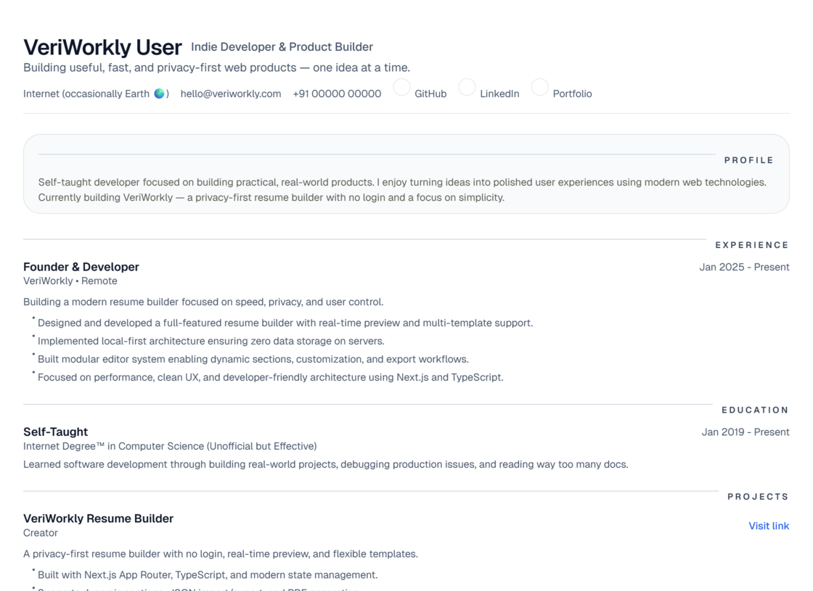
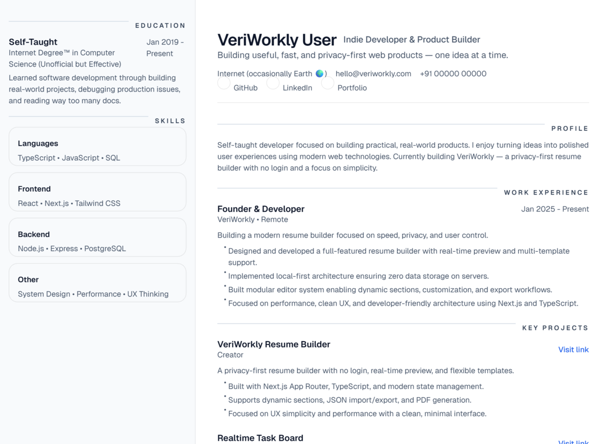
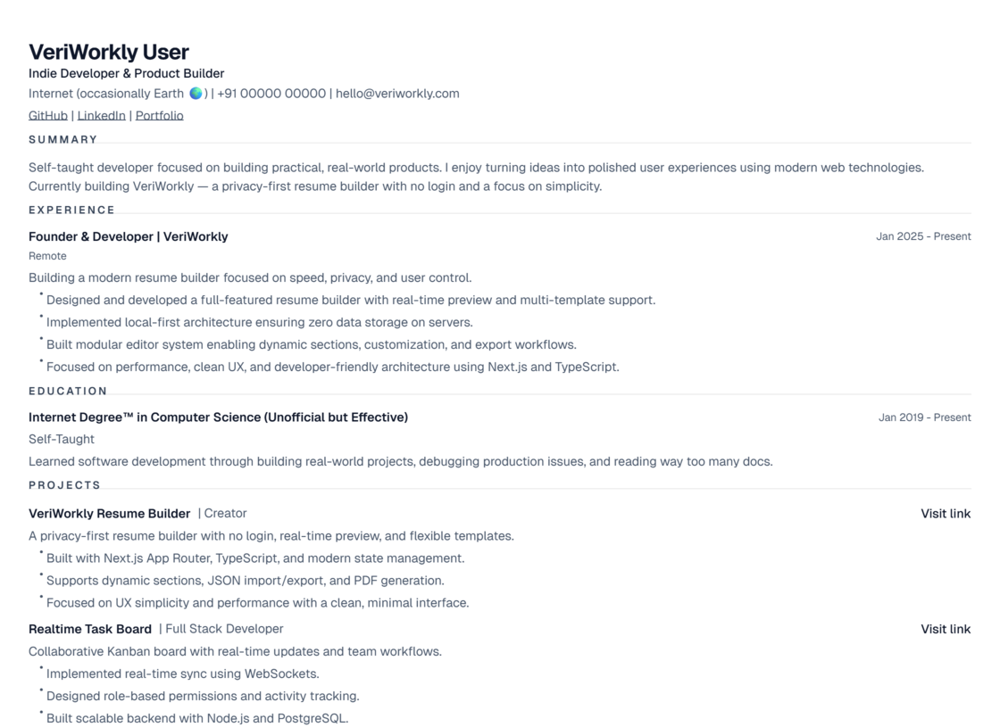
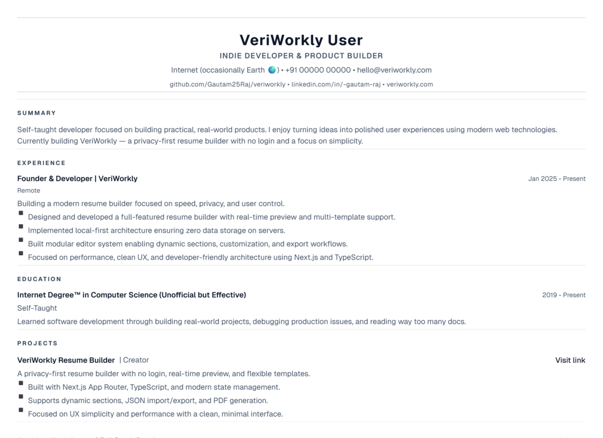
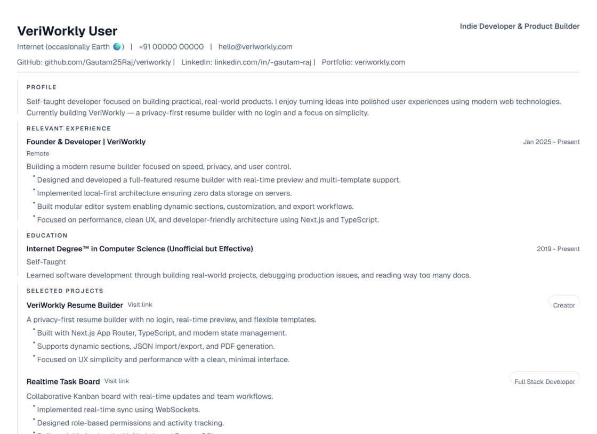
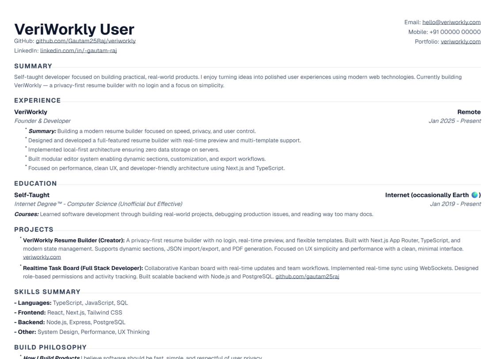

<div align="center">
  <a href="https://veriworkly.com">
    
  </a>

  <h1>VeriWorkly Resume</h1>

  <p>Build professional resumes without limits, accounts, or friction. 100% local-first and private.</p>

  <p>
    <a href="https://veriworkly.com"><strong>Get Started</strong></a>
    ·
    <a href="#"><strong>Learn More</strong></a>
    ·
    <a href="https://veriworkly.com/roadmap"><strong>Public Roadmap</strong></a>
  </p>

  <p>
    
    
    
  </p>
</div>

---

**VeriWorkly Resume** is a modern, production-quality resume builder designed to be 100% local-first and private. It features a distraction-free editor, real-time sync, and professional PDF/DOCX exports.

Built with privacy as a core principle, VeriWorkly gives you complete ownership of your data. The codebase is fully open-source under the MIT license, with no tracking, no ads, and no hidden costs.

## ✨ Features

**Resume Building**

- **Local-First & Private:** Your data stays in your browser. No login, no tracking, no data leaks.
- **Real-Time Editor:** Watch your resume update instantly as you type with zero lag.
- **Distraction-Free Mode:** Focus on your content with a clean, focused editing environment.
- **Rich Text Support:** Professional formatting with markdown-inspired simplicity.

**Templates**

- **Professionally Designed:** Switch between multiple high-impact styles without losing data.
- **Dynamic Customization:** Adjust colors, fonts, and spacing in real-time.
- **ATS-Optimized:** Templates designed to pass through Automated Tracking Systems with ease.
- **Multi-Format Export:** Export to high-quality PDF (via `jsPDF`) and DOCX (via `docx`).

**Platform**

- **Public Roadmap:** Built by the community. Vote on features and track progress.
- **Self-Hostable:** Run it locally or in production via Docker with minimal configuration.
- **Modern Tech:** Built with Next.js 15, TypeScript, and Tailwind CSS 4.

## 🎨 Templates

<table>
  <tr>
    <td align="center">
      
      <br /><sub><b>Modern</b></sub>
    </td>
    <td align="center">
      
      <br /><sub><b>Minimal</b></sub>
    </td>
    <td align="center">
      
      <br /><sub><b>Executive</b></sub>
    </td>
    <td align="center">
      
      <br /><sub><b>ATS Classic</b></sub>
    </td>
  </tr>
  <tr>
    <td align="center">
      
      <br /><sub><b>Professional</b></sub>
    </td>
    <td align="center">
      
      <br /><sub><b>Structured</b></sub>
    </td>
    <td align="center">
      
      <br /><sub><b>Academic Serif</b></sub>
    </td>
  </tr>
</table>

## 🚀 Quick Start

The quickest way to run VeriWorkly Resume locally:

```bash
# Clone the repository
git clone https://github.com/Gautam25Raj/veriworkly-resume.git
cd veriworkly-resume

# Start development server
npm install
npm run dev

# Access the app
open http://localhost:3000
```

For dockerized production setups and backend services, see the [Local Setup Guide](README.Local.md) or [Docker Guide](README.Docker.md).

## 🛠️ Tech Stack

| Category         | Technology                     |
| ---------------- | ------------------------------ |
| Framework        | Next.js 16 (App Router)        |
| Runtime          | Node.js                        |
| Language         | TypeScript                     |
| Database         | PostgreSQL (Neon) with Prisma  |
| Styling          | Tailwind CSS 4                 |
| State Management | Zustand                        |
| Export           | `jspdf`, `html2canvas`, `docx` |
| Auth             | Better Auth (OTP)              |

## 📖 Documentation

Detailed guides for various parts of the ecosystem:

| Guide                                          | Description                                  |
| ---------------------------------------------- | -------------------------------------------- |
| [Local Setup](README.Local.md)                 | Manual installation and environment config   |
| [Docker Deployment](README.Docker.md)          | Self-hosting with Docker Compose             |
| [Environment Setup](ENV_SETUP.md)              | Global configuration for API and Web         |
| [Project Architecture](server/ARCHITECTURE.md) | Deep dive into the backend and schema design |
| [Contributing](CONTRIBUTING.md)                | How to help build the future of VeriWorkly   |

## 🤝 Support & Contributing

VeriWorkly Resume is and always will be free and open-source. If it has helped you land a job or saved you time, please consider supporting continued development:

- **Star this repository** to help others discover it.
- **Follow the [Public Roadmap](app/admin/roadmap/page.tsx)** to suggest new features.
- **Submit a Pull Request** for bug fixes or new templates.

See [CONTRIBUTING.md](CONTRIBUTING.md) for more information.

## 📜 License

Distributed under the MIT License. See [LICENSE](LICENSE) for more information.

---

Built with ❤️ by [VeriWorkly Team](https://veriworkly.com)
